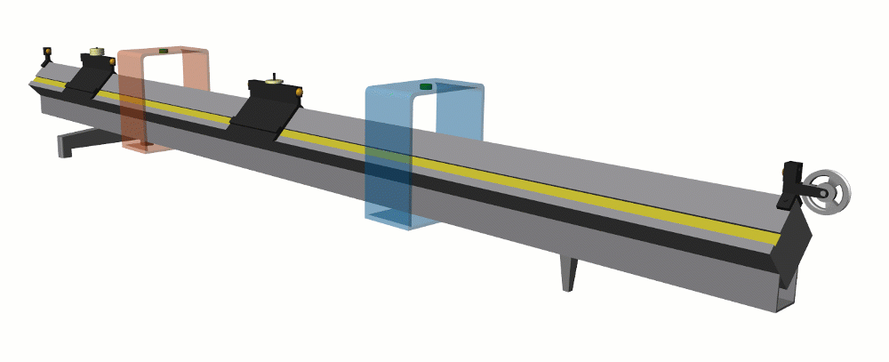

# Air Track Collisions Lab 
**Curriculum Module**  
_Created with R2021a. Compatible with R2021a and later releases._  

## Description ##
This curriculum module contains [Simscape Multibody](https://www.mathworks.com/products/simmechanics.html)&trade; models and [live scripts](https://www.mathworks.com/products/matlab/live-editor.html) that explore one-dimensional collisions using a virtual air track. The air track can be configured to model elastic or inelastic collisions. The live scripts contain instructions for conducting experiments using the virtual air track. The instructions include theory, pre-lab, virtual experiment, and data analysis sections. The law of conservation of momentum is studied by simulating elastic and inelastic collisions. The law of conservation of energy is studied by attaching a hanging mass to one of the carts.

Get started with the Air Track Collisions Lab by downloading and unzipping the repository. Then, double-click the project .prj file inside MATLAB&reg;. From there, you can follow the landing page instructions to get started with the lab.

**Learning Goals**
- Compare inelastic and elastic collisions.
- Use conservation laws to predict motion after collision.
- Measure the velocities of carts using photogate readings.
- Compute momentum and energy from experimental observations.
- Assess conservation of momentum.
- Assess conservation of energy.

## Details ##

**`airTrackLab.slx`**  
A Simscape Multibody model that simulates collisions on an air track. A description of how to use the model can be found in `airTrackLab_04_Explore_Virtual_Lab.mlx`.

## ##

**`Exercises/`**  
A folder that contains the instructions for the virtual experiment. The live scripts include theory, pre-lab questions, a guide to the virtual experiment, and data analysis.

## ##
**`CAD/  Images/`**  
STLs and images used by the Simscape Multibody models.

## Products ##
MATLAB, Simscape&trade;, Simscape Multibody

## License ##
The license for this module is available in the [LICENSE.TXT](license.txt) file in this GitHub repository.

## Support ##
Have any questions or feedback? Contact the <a href="mailto:onlineteaching@mathworks.com">MathWorks online teaching team.</a>

# #

_Copyright 2021 The MathWorks, Inc._
