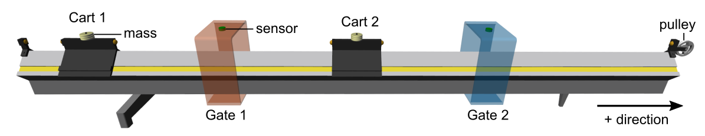
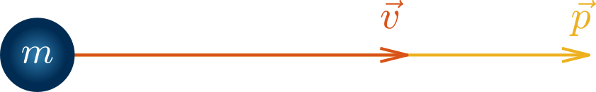
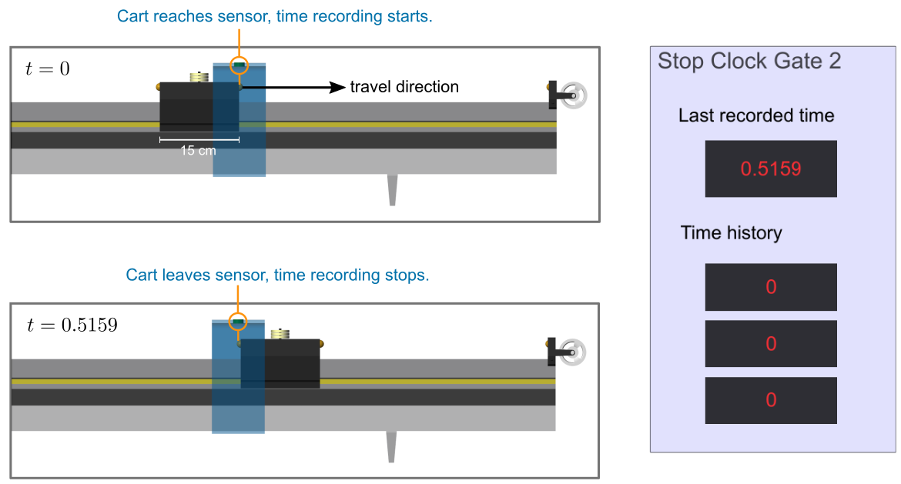
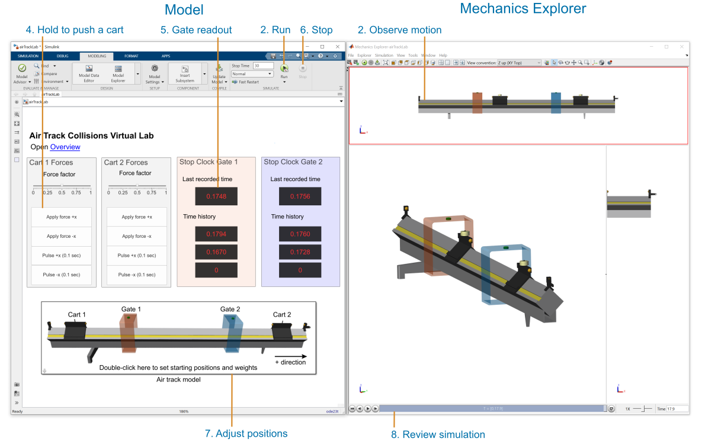
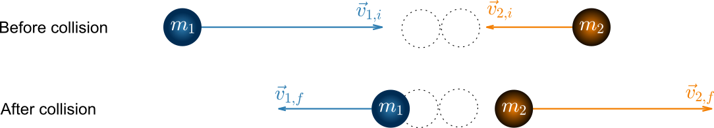
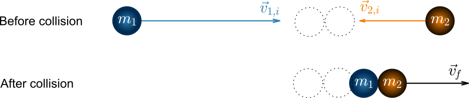
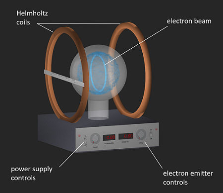

# Air Track Collisions Lab

 or 

**Curriculum Module**

_Created with R2021a. Compatible with R2024a and later releases._

# Information

This curriculum module contains interactive [MATLAB® live scripts](https://www.mathworks.com/products/matlab/live-editor.html) that explore one\-dimensional collisions using a virtual air track. The air track can be configured to model elastic or inelastic collisions.

## Background

You can use these live scripts as demonstrations in lectures, class activities, or interactive assignments outside class. This module covers elastic and inelastic collisions. It also includes examples of energy conservation. The live scripts contain instructions for conducting experiments using the virtual air track. The instructions include theory, pre\-lab, virtual experiment, and data analysis sections. The law of conservation of momentum is studied by simulating elastic and inelastic collisions. The law of conservation of energy is studied by attaching a hanging mass to one of the carts.

The instructions inside the live scripts will guide you through the exercises and activities. Get started with each live script by running it one section at a time. To stop running the script or a section midway (for example, when an animation is in progress), use the  Stop button in the **RUN** section of the **Live Editor** tab in the MATLAB Toolstrip.

## Contact Us

Contact the [MathWorks teaching resources team](mailto:onlineteaching@mathworks.com) if you would like to provide feedback, or if you have a question.

## Prerequisites

This module assumes knowledge of foundational physics principles and classical mechanics.

## Getting Started
### Accessing the Module
### **On MATLAB Online:**

Use the  link to download the module. You will be prompted to log in or create a MathWorks account. The project will be loaded, and you will see an app with several navigation options to get you started.

### **On Desktop:**

Download or clone this repository. Open MATLAB, navigate to the folder containing these scripts and double\-click on [Air\_Track\_Lab.prj](https://matlab.mathworks.com/open/github/v1?repo=MathWorks-Teaching-Resources/Air-Track-Collisions-Lab&project=Air_Track_Lab.prj&file=README.mlx). It will add the appropriate files to your MATLAB path and open an app that asks you where you would like to start. 

Ensure you have all the required products (listed below) installed. If you need to include a product, add it using the Add\-On Explorer. To install an add\-on, go to the **Home** tab and select   **Add-Ons** > **Get Add-Ons**. 

## Products
-  MATLAB® 
-  Simulink® 
-  Simscape™ 

# Scripts
## [**Theory.mlx**](https://matlab.mathworks.com/open/github/v1?repo=MathWorks-Teaching-Resources/Air-Track-Collisions-Lab&project=Air_Track_Lab.prj&file=Scripts/Theory.mlx) 
|      |      |
| :-- | :-- |
|     | **In this script, students will...**   $\bullet$ Learn about the theorical background of collisions.     |
|      |       |

## [**Prelab.mlx**](https://matlab.mathworks.com/open/github/v1?repo=MathWorks-Teaching-Resources/Air-Track-Collisions-Lab&project=Air_Track_Lab.prj&file=Scripts/Prelab.mlx) 
|      |      |
| :-- | :-- |
|     | **In this script, students will...**   $\bullet$ Learn about the virtual lab setup.   $\bullet$ Perform introductory calculations.     |
|      |       |

## [**VirtualLab.mlx**](https://matlab.mathworks.com/open/github/v1?repo=MathWorks-Teaching-Resources/Air-Track-Collisions-Lab&project=Air_Track_Lab.prj&file=Scripts/VirtualLab.mlx) 
|      |      |
| :-- | :-- |
|     | **In this script, students will...**   $\bullet$ Run simulations with the virtual lab.     |
|      |       |

## [**ElasticCollisions.mlx**](https://matlab.mathworks.com/open/github/v1?repo=MathWorks-Teaching-Resources/Air-Track-Collisions-Lab&project=Air_Track_Lab.prj&file=Scripts/ElasticCollisions.mlx) 
|      |      |
| :-- | :-- |
|     | **In this script, students will...**   $\bullet$ Conduct experiment with elastic collision.   $\bullet$ Perform measurements.   $\bullet$ Calculatate velocities before and after collision.     |
|      |       |

## [**InelasticCollisions.mlx**](https://matlab.mathworks.com/open/github/v1?repo=MathWorks-Teaching-Resources/Air-Track-Collisions-Lab&project=Air_Track_Lab.prj&file=Scripts/InelasticCollisions.mlx) 
|      |      |
| :-- | :-- |
|     | **In this script, students will...**   $\bullet$ Conduct experiment with inelastic collision.   $\bullet$ Perform measurements.   $\bullet$ Calculatate velocities before and after collision.     |
|      |       |

## [**EnergyConservation.mlx**](https://matlab.mathworks.com/open/github/v1?repo=MathWorks-Teaching-Resources/Air-Track-Collisions-Lab&project=Air_Track_Lab.prj&file=Scripts/EnergyConservation.mlx) 
|      |      |
| :-- | :-- |
|     | **In this script, students will...**   $\bullet$ Compute momentum and energy from experimental observations.   $\bullet$ Assess conservation of momentum.   $\bullet$ Asses conservation of energy.     |
|      |       |

# Related Courseware Modules

## [Virtual Measurement of the Electron to Mass ratio](https://www.mathworks.com/matlabcentral/fileexchange/94540-virtual-measurement-of-e-m-lab)
|      |      |
| :-- | :-- |
|     | **Available on:**          [GitHub](https://github.com/MathWorks-Teaching-Resources/Virtual-Measurement-of-the-Electron-Charge-To-Mass-Ratio-Lab)     |
|      |       |

Or feel free to explore our other [modular courseware content](https://www.mathworks.com/matlabcentral/fileexchange/?q=tag%3A%22courseware+module%22&sort=downloads_desc_30d).

# Educator Resources
-  [Educator Page](https://www.mathworks.com/academia/educators.html) 

# Contribute 

Looking for more? Find an issue? Have a suggestion? Please contact the [MathWorks teaching resources team](mailto:%20onlineteaching@mathworks.com). If you want to contribute directly to this project, you can find information about how to do so in the [CONTRIBUTING.md](https://github.com/MathWorks-Teaching-Resources/Air-Track-Collisions-Lab/blob/release/CONTRIBUTING.md) page on GitHub.

 *©* Copyright 2024 The MathWorks™, Inc

